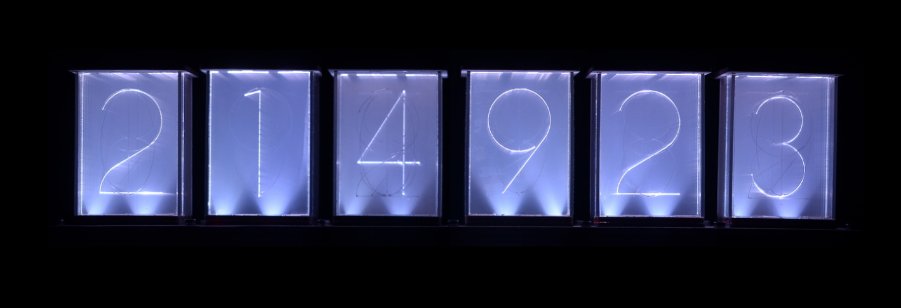

# Module: MMM-Cronixie

The `MMM-Cronixie` module is yet another clock for the [MagicMirror²](https://github.com/MichMich/MagicMirror).

This is a simple demo scene of [Cronixie](https://vk.com/cronixie) project.



## Installation

1. Go to the MagicMirror modules folder

```bash
cd ~/MagicMirror/modules
```

2. Clone this repository

```bash
git clone https://github.com/timophey/MMM-Cronixie.git
```

3. Add the this module to the modules array in the MagicMirror `config/config.js` file, like this:

```javascript
modules: [
  {
    module: "MMM-Cronixie",
    position: "middle_center",
    config:{
        width: "80vw",
        orientation: "landscape",
    }
  }
]
```
The following configurations are available:

Config       | Possible values            | Default value | Description
:------------|:---------------------------|:--------------|:------------
`width`      | `80vh` `500px` `20em`      | `90vw`        | Width in CSS units
`orientation`| `landscape` or  `portrait` | `landscape`   | Array or vertical tower view

## Todo

- [ ] Color shift animations
- [ ] Roll and Fade transitions
- [ ] Roll right to left and even-numbered on minute change
